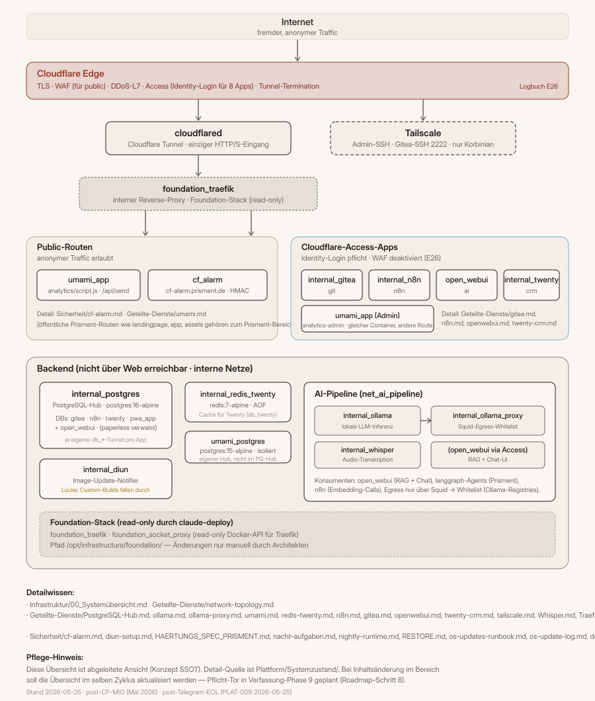

# Plattform — Bereichs-Übersicht

**Abschalt-Test:** Was unter Plattform liegt, würde auch ohne ein
einzelnes Projekt weiterleben. „Plattform" = die geteilte Bühne, auf
der mehrere Projekte stehen können (heute: Prisment-Produkt, perspektivisch
weitere).

## Architektur in einem Bild

> Falls das eingebettete SVG nicht erscheint: `01_Architektur.svg` direkt
> im selben Verzeichnis öffnen. Obsidian-Variante: `![[01_Architektur.svg]]`.

## Drei Zonen, drei Vertrauensstufen

- **🟦 Public-Routen.** Was anonym aus dem Internet erreichbar ist —
  Umami-Tracking-Endpoint, `cf-alarm.prisment.de` (HMAC-signiertes
  Cloudflare-Notification-Webhook). Plus die öffentlichen Prisment-Routen
  (Landingpage, PWA, Assets), die organisch dazu gehören aber im
  Prisment-Bereich dokumentiert sind.
- **🟪 Cloudflare-Access-Apps.** Was nur nach Identity-Login bei
  Cloudflare Access erreichbar ist (E-Mail `korbinian.schnall@prisment.de`).
  Acht Apps: `n8n`, `git`, `ai` (Open-WebUI), `crm` (Twenty), `admin`,
  `konzept`, `agent-content`, `analytics-admin` (Umami-Dashboard). WAF
  ist für diese Hosts deaktiviert (Logbuch E26 — Access ist die Auth,
  WAF davor produziert False Positives).
- **🟧 Admin-Pfad (Tailscale).** SSH zum Host und Gitea-SSH (Port 2222)
  ausschließlich über das Tailnet. Keine Dienst-UIs mehr über Tailscale —
  die laufen alle über Cloudflare Access.

## Auth in einem Satz

Cloudflare Access ist die Identity-Schicht vor dem Tunnel — die App-
Container vertrauen den `Cf-Access-…`-Headern und führen darüber hinaus
ihre eigene Session-Verwaltung (Twenty-JWT, n8n-Session, Open-WebUI-
Session etc.).

## Sub-Übersichten

- **`02_Infrastruktur.md`** — Hardware, Compose-Stacks, Verzeichnisstruktur,
  Update-Pipeline.
- **`03_Geteilte-Dienste.md`** + `03_Geteilte-Dienste.svg` — Topologie
  der laufenden Plattform-Dienste, ihre Beziehungen und Datenflüsse.
- **`04_Sicherheits-Architektur.md`** + `04_Sicherheits-Architektur.svg` —
  Verteidigungs-Schichten, HARDENING-Status (Phase 5 RLS noch offen),
  nightly-Mechanik.

## Detail-Dokus (Quelle der Wahrheit)

Diese Übersicht ist **abgeleitete Ansicht**, nicht zweite Quelle (SSOT,
Verfassung 03). Die folgenden Detail-Dokus sind die maßgebliche Quelle:

### Infrastruktur

| Datei | Inhalt |
|---|---|
| [`Systemzustand/Infrastruktur/00_Systemübersicht.md`](../Infrastruktur/00_Systemübersicht.md) | Vollständige Systemübersicht inkl. Service-Inventar |
| [`Systemzustand/Infrastruktur/00_System_Environment_Versions.md`](../Infrastruktur/00_System_Environment_Versions.md) | Image-Pinning-Übersicht aller Container |

### Geteilte Dienste

| Container | Detail-Doku |
|---|---|
| `cloudflared` | [`cloudflared.md`](../Geteilte-Dienste/cloudflared.md) |
| `foundation_traefik` | [`Traefik.md`](../Geteilte-Dienste/Traefik.md) |
| `internal_postgres` | [`PostgreSQL-Hub.md`](../Geteilte-Dienste/PostgreSQL-Hub.md) |
| `internal_gitea` | [`gitea.md`](../Geteilte-Dienste/gitea.md) |
| `internal_n8n` | [`n8n.md`](../Geteilte-Dienste/n8n.md) |
| `internal_open_webui` | [`openwebui.md`](../Geteilte-Dienste/openwebui.md) |
| `internal_ollama` | [`ollama.md`](../Geteilte-Dienste/ollama.md) |
| `internal_ollama_proxy` | [`ollama-proxy.md`](../Geteilte-Dienste/ollama-proxy.md) |
| `internal_twenty` | [`twenty-crm.md`](../Geteilte-Dienste/twenty-crm.md) |
| `internal_redis_twenty` | [`redis-twenty.md`](../Geteilte-Dienste/redis-twenty.md) |
| `internal_whisper` | [`Whisper.md`](../Geteilte-Dienste/Whisper.md) |
| `umami_app` + `umami_postgres` | [`umami.md`](../Geteilte-Dienste/umami.md) |
| `internal_diun` | [`Sicherheit/diun-setup.md`](../Sicherheit/diun-setup.md) |
| `cf_alarm` | [`Sicherheit/cf-alarm.md`](../Sicherheit/cf-alarm.md) |

Plus Querschnitts-Dokus:
- [`network-topology.md`](../Geteilte-Dienste/network-topology.md) — Docker-Netze + Segmentierung
- [`gitea-tenant-struktur.md`](../Geteilte-Dienste/gitea-tenant-struktur.md) — Tenant-Repos in Gitea
- [`backup-restore.md`](../Geteilte-Dienste/backup-restore.md) — Restic-Backup-Mechanik
- [`Claude Code Service Dokumentation.md`](../Geteilte-Dienste/Claude%20Code%20Service%20Dokumentation.md) — Claude-Code-Setup
- [`tailscale.md`](../Geteilte-Dienste/tailscale.md) — Admin-Pfad
- [`KI-Wissenspipeline.md`](../Geteilte-Dienste/KI-Wissenspipeline.md) — ⚠️ VERALTET (eigener Re-Write-Seed offen)

### Sicherheit

| Datei | Inhalt |
|---|---|
| [`HAERTUNGS_SPEC_PRISMENT.md`](../Sicherheit/HAERTUNGS_SPEC_PRISMENT.md) | Gesamtprojekt; CF-MIG ✅, Telegram-EOL ✅, Tenant-Isolation Phase 5 ⬜ |
| [`nightly-runtime.md`](../Sicherheit/nightly-runtime.md) | nightly-Lauf-Mechanik |
| [`nacht-aufgaben.md`](../Sicherheit/nacht-aufgaben.md) | Steuerdatei (Integritäts-gechecked) |
| [`RESTORE.md`](../Sicherheit/RESTORE.md) | Disaster-Recovery-Runbook |
| [`os-updates-runbook.md`](../Sicherheit/os-updates-runbook.md) + [`os-update-log.md`](../Sicherheit/os-update-log.md) | unattended-upgrades |
| [`docker-update-log.md`](../Sicherheit/docker-update-log.md) | Container-Update-Verlauf |

## Was sich gegenüber pre-CF-MIG geändert hat (Stand: Mai 2026)

- **Authentik abgebaut** — Auth läuft über Cloudflare Access. Logbuch
  E25/E26 dokumentiert die EOL-Schritte.
- **Mattermost entfernt** (HARDENING Phase 1.1).
- **Telegram + Twilio aus Produktbetrieb** — `n8n`-Workflows weg,
  Code-Pfade in langgraph weg, compose-env-Vars weg (PLAT-009 abgeschlossen).
- **`cloudflared` als Edge** — kein Inbound-Port mehr auf der Server-IP,
  alles über Tunnel.
- **WAF-Skip für Access-Apps** — Custom-Rule deaktiviert OWASP + Bot +
  Rate-Limit für die 8 Access-Hosts (siehe Logbuch E26).

## Pflege-Hinweis

Diese Übersicht ist abgeleitete Ansicht (Konzept SSOT). Bei einer
Systemzustands-Änderung im Plattform-Bereich soll diese Übersicht
(MD + SVG) im selben Zyklus mit aktualisiert werden — sonst entsteht
stille Doppel-Wahrheit. Eine maschinelle Verpflichtung (Pflicht-Tor in
Verfassung-Phase 9) ist in Schritt 8 der Roadmap geplant
(`_Betrieb/Backlog/ROADMAP_lebende-bereichs-doku.md`).
